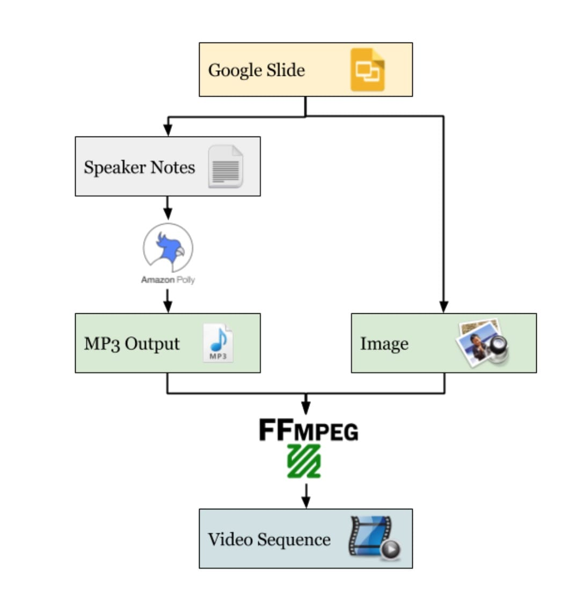
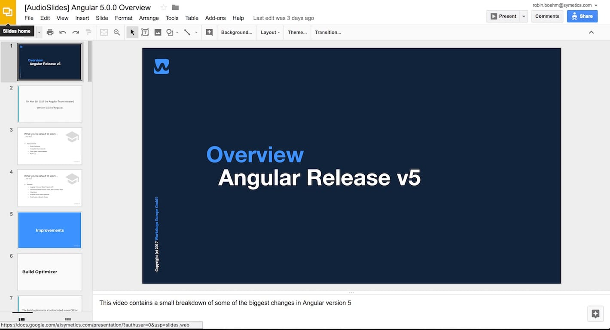

# AudioSlides.IO

## tl;dr

Generate small videos with spoken text from Google Slides.

Using Amazon Polly, Google Slides and FFMpeg to create videos that can be updated at anytime by anyone. This project is written in Elixir.

## Why? Problems when creating Video Content
Have you ever created a video in which you recorded some spoken text? It takes a lot of courage to record your own voice and publish it online to an unknown audience. Oftentimes you feel like your own voice sounds kind of strange. And so you **record your voice a thousand times** and try to make it as perfect as possible. 

Once I’ve accomplished a record that meets my expectations I always go through a “family and friends review process”. When it comes to English I like to get my content reviewed by my girlfriend because she’s a native speaker and also really frank. So she doesn’t hold anything back. The result of this ist that **I need to recreate some parts of these audio recording**. And recreate some parts of a course that may have up to 20 hours of content in sum is really annoying. Let’s take a look at some problems that will occur if I try to fix some content in my audio recording.

**I need to record it with the same microphone.**
Every microphone sounds different. You can’t combine 2 different recordings, sounds really weird.

**I need to record it at the same room.**
Every room has it’s very own acoustics. If I do a recording in my apartment it sounds very different to one in our office. But if you did the first recording in the office, you have to wait until everybody is gone and it’s quiet enough. 

**I need to be hit the same tone.**
On a recording you notice if you did that recording on a different day in a different mood. There is always a gap when you “glue” some parts together with audio production software.

**It has to be the same voice.**
It’s not possible for anyone else than myself to fix or update the recorded content. That is really annoying and blocks you to really scale a productive team.

I also thought about booking a **professional speaker** or agency for this. Because than you don’t have to deal with many of these problems like myself being non-native speaker. But I also need to recreate video content if some update in content, such as a breaking change in Angular technology, occurred. How long does it take to do an update? What if the speaker isn’t available anymore? To create “only evergreen” content also isn’t a solution if you want to help people **learn new things**. So let’s think about an improvement for the process of creating and updating video content.
How? Generate the voice using Speech Synth
The problem is that recording audio for an video course is really time consuming and could fail because of many reasons. How can we accomplish an easy and repeatable solution for creating a video with spoken text? 

If you’re doing a bit of research and read some technical news you may be impressed by the development of the **speech-synth** tools that getting much better very fast. The current state is that this speech-synth tools aren’t that good to use for everything, but good enough to try them out and not get annoyed by the generated voice. **My bet is that maybe in a year or two there is a service or tool that does the job really really well.** So let’s write a prototype today to be ready when this time has come!

## The Prototype
For our prototype we decided to give **Amazon Polly** a try. It has a good and simple HTTP-API that allows you to convert text to speech really easily.

For the visual layer we just used **Google Slides** because they also provide a really good REST-API that allows you to easily export PNG of a slide. It’s also possible to get the speaker notes via the same API that could be the input for the Amazon Polly transformation.

The last step is to combine the generated voice output with the exported png image and produce a small video sequence. For this we just used a handy command line interface called **FFMPEG**. So the basic processing would look something like this:

## Example Input & Output
As shown before we need a Google Presentation to start from. My input will be a short slide deck about the new release of Angular version 5.

### Google Slides as Input

### Generated Video as Output

## How to start the project

To start your Phoenix server:

  * Install dependencies with `mix deps.get`
  * Install Node.js dependencies with `cd assets && npm install`
  * Start Phoenix endpoint with `mix s`

Now you can visit [`localhost:4000`](http://localhost:4000) from your browser.

## How to test

Run all tests

    mix t

Run all test with integration test(ffmpeg, write files)

    mix test.integration